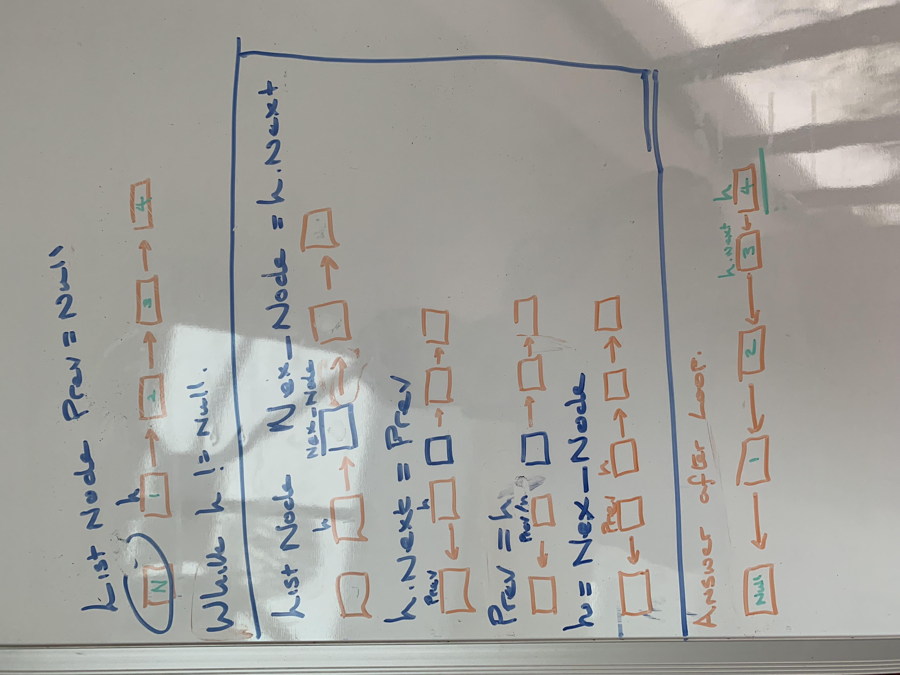

# Reverse a linked list

[Question](https://leetcode.com/problems/reverse-linked-list/)

First we create a new empty node called previous, We Loop through the linked list until there are no nodes left, create a new node called Node_next, this stores the reference to the head.next node. We then update the head.nexts reference to the previous node. We then say that the head is the previous node.
We then update the heads reference to the next node which was stored earlier in the Node_next.

